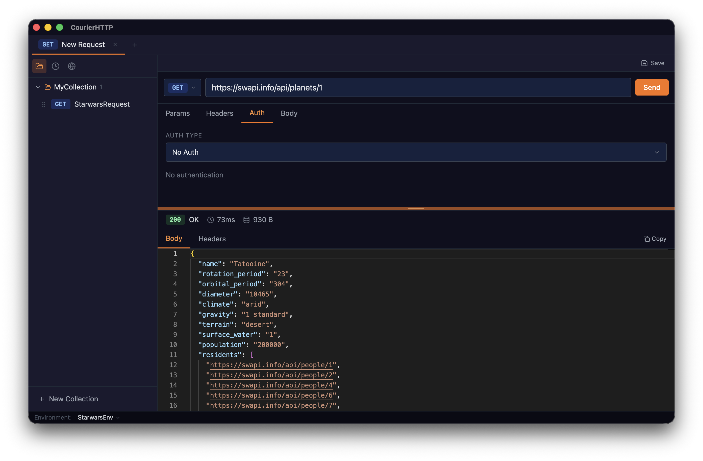

# CourierHTTP

<p align="center">
  <a href="https://v2.tauri.app"></a>
  <a href="https://www.rust-lang.org"></a>
  <a href="https://www.typescriptlang.org"></a>
  <a href="https://tailwindcss.com"></a>
  <a href="https://zustand.docs.pmnd.rs/learn/getting-started/introduction"></a>
  <a href="https://github.com/Suhird/courier-http/actions/workflows/release.yml"></a>
  
  <a href="https://github.com/Suhird/courier-http/blob/main/LICENSE"></a>
</p>


### Screenshots

|Response Viewer |
|-----------------|
| |

A free, local, offline-first desktop HTTP client — a Postman alternative that runs entirely on your machine with no accounts, no cloud sync, and no telemetry. **Free forever. No paid tiers, no paywalls, no subscriptions — ever.** Your data never leaves your computer.

Built with Tauri v2, React 18, TypeScript, and Rust.

---

## Features

- **Send HTTP requests** — GET, POST, PUT, PATCH, DELETE, HEAD, OPTIONS
- **Request configuration** — query params, headers, auth, body (JSON, plain text, XML, HTML, form-urlencoded, multipart form-data)
- **Authentication** — Bearer token, Basic auth, API key (header or query), OAuth2
- **Environment variables** — define variable sets, switch between them, interpolate `{{variables}}` in URLs and values
- **Collections** — save and organise requests, drag-and-drop reorder, export to JSON
- **History** — automatic request history (last 200 entries)
- **Response viewer** — status, duration, size, syntax-highlighted body (JSON, HTML, XML), headers table
- **Copy response** — one-click copy button on the response panel
- **Resizable panels** — drag the divider between request and response panels to resize
- **Multi-tab** — multiple open requests with independent state
- **Right-click disabled** — no browser DevTools exposed to end users

---

## Tech Stack

| | |
|---|---|
| Desktop shell | Tauri v2 |
| Frontend | React 18 + TypeScript |
| Build tool | Vite |
| Styling | Tailwind CSS v3 |
| State | Zustand v5 |
| Code editor | Monaco Editor |
| HTTP engine | Rust + reqwest |

---

## Prerequisites

- **Node.js** 18+
- **Rust** (stable) — install via [rustup.rs](https://rustup.rs)
- **Tauri CLI prerequisites** — see [Tauri v2 prerequisites](https://v2.tauri.app/start/prerequisites/) for your OS

### macOS

```bash
xcode-select --install
```

### Linux

```bash
sudo apt install libwebkit2gtk-4.1-dev libappindicator3-dev librsvg2-dev patchelf
```

---

## Setup

```bash
# Clone the repo
git clone https://github.com/Suhird/courier-http.git
cd courier-http

# Install frontend dependencies
npm install
```

---

## Development

```bash
npm run tauri dev
```

This starts Vite for the frontend and compiles the Rust backend, then opens the app window. Hot-reload is active for the frontend; Rust changes require a full recompile.

---

## Build (production)

```bash
npm run tauri build
```

Output is in `src-tauri/target/release/bundle/`.

---

## Tests

### Frontend (Vitest)

```bash
npm test
```

349 tests covering utility functions, Zustand stores, hooks, and React components.

> Test files are excluded from the production TypeScript build via `tsconfig.json`. Run tests with `npm test`; they use a separate vitest config.

### Rust backend (Cargo)

```bash
cd src-tauri
cargo test
```

58 tests covering model serialization, storage layer, command logic, and HTTP execution (uses `wiremock` for mock HTTP server tests — all 5 auth types covered).

---

## Project Structure

```
courier-http/
├── index.html              # app entry point
├── src/
│   ├── types/index.ts      # shared TypeScript types
│   ├── lib/                # interpolate, tauri wrappers, utils
│   ├── hooks/              # useRequestSend
│   ├── store/              # Zustand stores (requests, collections, environments, history)
│   ├── components/
│   │   ├── shared/         # Badge, KeyValueTable, MonacoEditor
│   │   ├── layout/         # TabBar, StatusBar
│   │   ├── request/        # UrlBar, RequestBuilder and all request tabs
│   │   ├── response/       # ResponseViewer and sub-components
│   │   └── sidebar/        # Collections, History, Environments, SaveRequestModal
│   └── App.tsx
├── src-tauri/
│   ├── src/
│   │   ├── models/         # Rust data models (serde)
│   │   ├── storage/        # filesystem read/write (atomic)
│   │   ├── commands/       # Tauri command handlers
│   │   └── lib.rs          # app entry, command registration
│   └── Cargo.toml
└── src/__tests__/          # frontend test suite
```

---

## Privacy & Cost

CourierHTTP is **100% free** — no paid plans, no feature gates, no subscriptions, and that will never change.

All data stays on your machine. The app makes no network connections except the HTTP requests you explicitly send. There is no telemetry, no analytics, no crash reporting, no account system, and no cloud sync. Nothing you type, save, or send is ever transmitted anywhere other than the endpoints you choose.

## Data storage

All data is stored locally on disk. No cloud, no accounts, no telemetry.

| Data | macOS | Windows |
|---|---|---|
| Collections | `~/Library/Application Support/courier-http/collections/` | `%APPDATA%\courier-http\collections\` |
| Environments | `~/Library/Application Support/courier-http/environments/` | `%APPDATA%\courier-http\environments\` |
| History | `~/Library/Application Support/courier-http/history.json` | `%APPDATA%\courier-http\history.json` |

---

## Releases

Pre-built installers for macOS (Apple Silicon + Intel) and Windows are available on the [GitHub Releases](../../releases) page.

See [Deployment.md](./Deployment.md) for the full release process, code signing setup, and Homebrew tap instructions.

### macOS — first launch

If the app is not code-signed, macOS Gatekeeper will block it on first open. Run once to clear the quarantine flag:

```bash
xattr -cr /Applications/CourierHTTP.app
```
